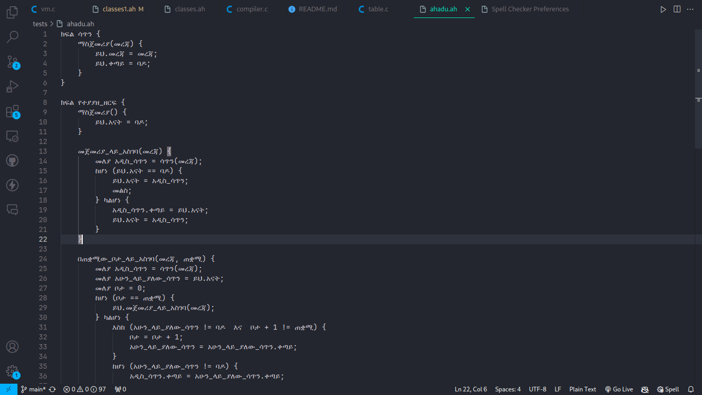
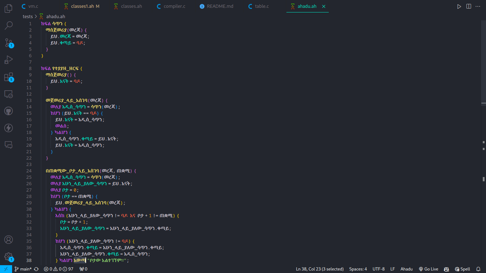

# ahadu README

This is the README for your extension "ahadu". it allows ahadu source code Syntax highlighting.

## Features

this extension allows ahadu programming languge to have syntax highlighting on vscode

### Before the extension

### After the extension

## Release Notes

### 1.0.0

Initial release of ahadu extension for vscode
